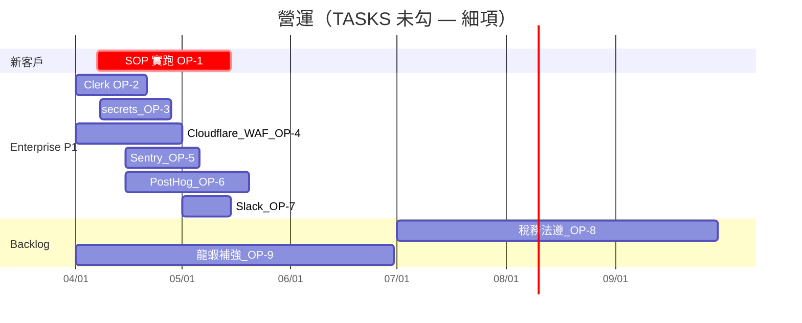
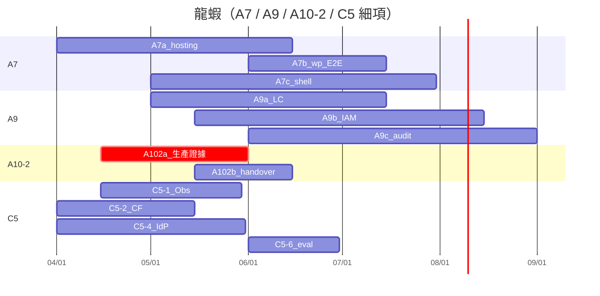
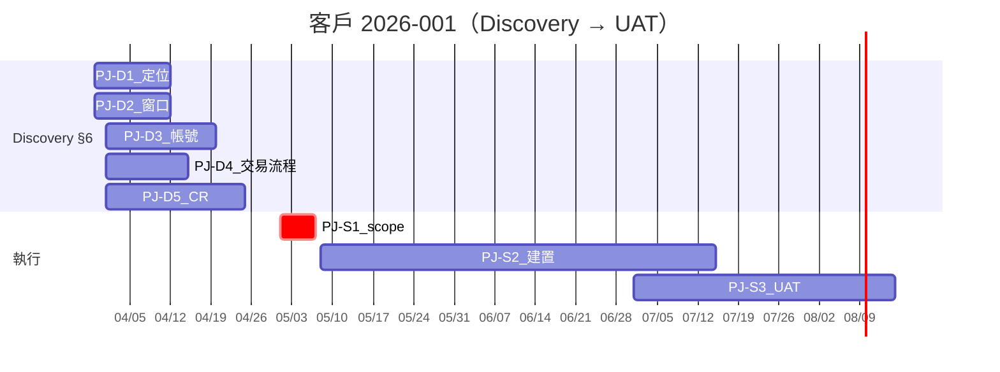

# Program timeline（營運 + 龍蝦 + 客戶案｜細項版）

> **用途**：把「還沒勾的」工作拆成**可排程、可驗收**的細項；**仍不**取代 `TASKS.md`、`LOBSTER_FACTORY_MASTER_CHECKLIST.md`、客戶 Discovery——本檔是**規劃鏡像**，真相以勾選檔為準。

---

## AO-CLOSE 會不會自動更新本檔？

**會更新「一半」：表格＋三張 Mermaid 甘特會自動重渲；你改的來源是 `PROGRAM_SCHEDULE.json`。**

| 動作 | 會更新的產物 |
|------|----------------|
| **`ao-close.ps1` 一鍵收工** | `verify-build-gates` → `system-guard` → **`generate-integrated-status-report.ps1`**（末尾呼叫 **`render-program-timeline-from-schedule.ps1`**）→ 刷新 **`reports/status/integrated-status-LATEST.md`** **與本檔下方自動產生區**（自 JSON 渲染表／甘特） |
| **排程資料（給試算表／甘特 AI／他系匯入）** | 請維護 **`docs/overview/PROGRAM_SCHEDULE.json`**；必要時複製到 `project-kit` 範本或客戶 tenant 再改路徑重跑渲染 |
| **`TASKS.md`／Checklist／Discovery** | **不會**被 AO-CLOSE 改寫——**完成與否仍以勾選檔為準**；JSON 是**規劃鏡像**，請在改期時與勾選檔人工對齊 |

**建議節奏**：改期 → 先改 **`PROGRAM_SCHEDULE.json`** → **AO-CLOSE**（或單獨跑渲染腳本）→ 瞄一眼表與甘特；再用 `integrated-status-LATEST.md` 對照本週實際缺口。

---

## 真實來源（單一真相）

| 流 | 勾選與細項 | 拼裝懶人包 |
|----|------------|------------|
| 營運 | [`TASKS.md`](../../TASKS.md) | [`integrated-status-LATEST.md`](../../reports/status/integrated-status-LATEST.md) §1–2 |
| 龍蝦 | [`LOBSTER_FACTORY_MASTER_CHECKLIST.md`](../../../lobster-factory/docs/LOBSTER_FACTORY_MASTER_CHECKLIST.md) | 同上 §3 |
| 客戶 | [`10_DISCOVERY.md`](../../tenants/company-p1-pilot/projects/2026-010-p1-pilot/10_DISCOVERY.md) 等 | 專案資料夾；並列 [`PROGRAM_SCHEDULE.json`](PROGRAM_SCHEDULE.json) **客戶流**（可複製到專案內維護） |

---

<!-- program-schedule:generated-begin -->

> **Auto-generated block** (Chinese layout below is for readers): Tables and the three Mermaid Gantt charts come from this file. Edit `PROGRAM_SCHEDULE.json`, then run `scripts/render-program-timeline-from-schedule.ps1` or **AO-CLOSE** (runs after `integrated-status` is built). Checkbox files (`TASKS`, Checklist, Discovery) remain the truth for **done/not done**; keep JSON aligned when dates slip.

## 1) 營運細項（對照 `TASKS.md` 未勾）

> 狀態僅示意：** Planned / Blocked ** 請依實際改；日期為**規劃假設**，承諾日以你在 `WORKLOG` 記載為準。

| ID | 工作項 | 預計起 | 預計迄 | 依賴 | 驗收（DoD） |
|----|--------|--------|--------|------|------------|
| **OP-1** | 用 1 個新客戶實跑 `NEW_TENANT_ONBOARDING_SOP.md` | 2026-04-07 | 2026-05-15 | 真實 tenant／窗口；與 A10-2 | SOP 步驟跑完 + 證據進 `WORKLOG`；`TASKS` 可勾 |
| **OP-2** | Enterprise P1：**Clerk** auth 串應用流程 | 2026-04-01 | 2026-04-21 | 專案／redirect、`secrets` | 可登入／可區分環境；錯誤可追 |
| **OP-3** | Enterprise P1：**env／mcp secrets** 治理（輪替／不可入庫） | 2026-04-08 | 2026-04-28 | vault 路徑、`AGENTS` 政策 | 文件與實機一致；關鍵不在明文 repo |
| **OP-4** | Enterprise P1：**Cloudflare** WAF／rate-limit 最小設 | 2026-04-01 | 2026-05-01 | 帳號／zone | 規則截圖或導出 + `WORKLOG` |
| **OP-5** | Enterprise P1：**Sentry** error ingest | 2026-04-15 | 2026-05-06 | DSN／release | 測試事件抵達專案 |
| **OP-6** | Enterprise P1：**PostHog** core events | 2026-04-15 | 2026-05-20 | 專案 key | ≥3 個命名事件在 dashboard 可見 |
| **OP-7** | Enterprise P1：**Slack** alerts（要通道＋閾值） | 2026-05-01 | 2026-05-15 | webhook、噪音策略 | 一次 E2E 告警測試成功 |
| **OP-8** | Backlog：跨國稅務與法遵**外部**審核流程 | 2026-07-01 | 2026-09-30 | 法律顧問窗口 | 流程文件 + 觸發條件写進 `docs` |
| **OP-9** | Backlog：龍蝦 Enterprise 補強路線（與 C5 對齊） | 2026-04-01 | 2026-06-30 | `TASKS` 與 Checklist | `TASKS` 該項可勾或改敘述 |

### AO 流甘特（Mermaid）

---

## 2) 龍蝦細項（對照 `MASTER_CHECKLIST` 未勾 A／C5）

| ID | 工作項 | 預計起 | 預計迄 | 依賴 | 驗收（DoD） |
|----|--------|--------|--------|------|------------|
| **LF-A7a** | **Hosting**：真實 vendor／adapter 與 `resolveStagingProvisioning` 對齊（非僅 stub） | 2026-04-01 | 2026-06-15 | 供應商 API／測試帳 | staging 一次完整 provision 證據 + `WORKLOG` |
| **LF-A7b** | **create-wp-site**：端到端建立站台（staging）+ 健康檢查 | 2026-06-01 | 2026-07-15 | after A7a | 可查 URL／後台；drill 報告 |
| **LF-A7c** | **Shell**：生產級 guardrails + 與 `apply-manifest` 稽核欄位一致 | 2026-05-01 | 2026-07-31 | A7b | 失敗路徑可重現；rollback 證據 |
| **LF-A9a** | **Artifacts**：雲端物件**生命週期**（留存／刪除／分桶）政策落地 | 2026-05-01 | 2026-07-15 | 雲端帳單／合規 | 書面政策 + IaC 或 runbook |
| **LF-A9b** | **IAM**：最小權限角色／金鑰輪替 | 2026-05-15 | 2026-08-15 | A9a | 權限表 + 稽核清單 |
| **LF-A9c** | **稽核**：自動化報表／告警（誰改了什麼） | 2026-06-01 | 2026-09-01 | A9b | 週報或 SIEM 規則截圖 |
| **LF-A102a** | **A10-2**：新客戶管線與 Lobster workflow **生產**證據（可重跑） | 2026-04-15 | 2026-06-01 | OP-1、Trigger | 固定 `workflow_runs` id 或報告鏈 |
| **LF-A102b** | **A10-2**：驗收／Handover 與 `TASKS` 勾選同步 | 2026-05-15 | 2026-06-15 | A102a | Checklist A10-2 可勾 |
| **LF-C51** | **C5-1** Sentry + PostHog（與 OP-5/6 對齊；此處為**工程側**到位） | 2026-04-15 | 2026-05-30 | 專案開通 | staging／prod 分流策略文件 |
| **LF-C52** | **C5-2** Cloudflare 工程側（與 OP-4） | 2026-04-01 | 2026-05-15 | zone | Workers／WAF 與 repo 設定一致 |
| **LF-C53** | **C5-3** Secrets manager（1Password 或同級）若升級 | TBD | TBD | 付費／IT | 與 `TASKS` Backlog 同步決策 |
| **LF-C54** | **C5-4** Identity（Clerk 已定）— 與 org／RBAC 邊界 | 2026-04-01 | 2026-05-31 | OP-2 | 角色矩陣一頁 |
| **LF-C55** | **C5-5** Cost／Decision 可觀測 | TBD | TBD | PostHog／帳單 API | budget 告警 PoC |
| **LF-C56** | **C5-6** 後續工具（Langfuse 等）評估清單 | 2026-06-01 | 2026-06-30 | C51–55 | 決策記 `WORKLOG` |

### LF 流甘特（Mermaid）

---

## 3) 客戶案 `2026-001` 細項（`10_DISCOVERY.md` §6 + 後階）

| ID | 工作項 | 預計起 | 預計迄 | 依賴 | 驗收 |
|----|--------|--------|--------|------|------------|
| **PJ-D1** | Discovery：**品牌定位／受眾**定稿 | 2026-03-30 | 2026-04-12 | 客戶訪談 | 寫回 §1／§6；`WORKLOG` |
| **PJ-D2** | Discovery：**決策者／窗口／簽核** | 2026-03-30 | 2026-04-12 | D1 | RACI 或一句話載明 |
| **PJ-D3** | Discovery：**第三方帳號與權限交付**計畫 | 2026-04-01 | 2026-04-20 | D2 | 清單 + 日期 |
| **PJ-D4** | Discovery：**交易型流程**（會員／付款／預約）是否納入本期 | 2026-04-01 | 2026-04-15 | D1 | 範圍段落凍結 |
| **PJ-D5** | Discovery：**CR 估價基準**（套裝／工時） | 2026-04-01 | 2026-04-25 | 內部報價政策 | 文件一頁 |
| **PJ-S1** | **Scope 凍結**（可進設計／工時排程） | 2026-05-01 | 2026-05-07 | D1～D5 | 簽名或郵件紀錄 |
| **PJ-S2** | **設計／建置**（粗粒度；細拆在專案內） | 2026-05-08 | 2026-07-15 | PJ-S1、LF-A7 部分能力 | 專案內 milestone |
| **PJ-S3** | **UAT / 上線／回滾演練** | 2026-07-01 | 2026-08-15 | PJ-S2 | `10_DISCOVERY` 驗收條件 |

### PJ 流甘特（Mermaid）

---

<!-- program-schedule:generated-end -->

## 與每日／收工習慣

- **每日**：`TASKS.md` + Checklist 頂部未完成；若要動到表單日期，先改 **`PROGRAM_SCHEDULE.json`** 再跑渲染（或等 **AO-CLOSE**）。  
- **AO-CLOSE 後**：讀 **`integrated-status-LATEST.md`**；下方表／甘特已自 JSON 重渲，**完成度**仍以勾選檔為準。  
- **儀表板**：[`EXECUTION_DASHBOARD.md`](EXECUTION_DASHBOARD.md)（含「進度實際住在哪」一表）。

## Related Documents (Auto-Synced)
- `docs/overview/EXECUTION_DASHBOARD.md`
- `docs/overview/INTEGRATED_STATUS_REPORT.md`
- `docs/overview/PROGRAM_SCHEDULE.json`
- `TASKS.md`
- `WORKLOG.md`

_Last synced: 2026-03-29 15:19:41 UTC_

