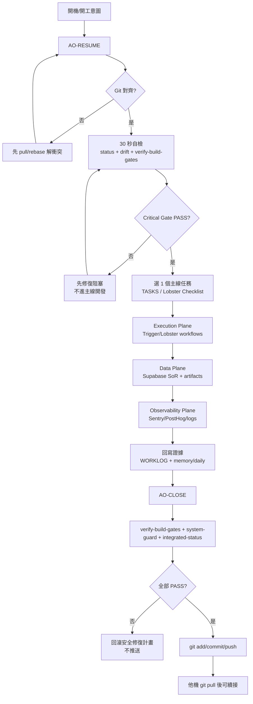

# AO + Lobster Operating Model

> Purpose: one operating model for how Agency OS governance and Lobster Factory execution run together, so daily work does not split across inconsistent docs.

## 1) System Roles (Who owns what)

- `Agency OS`: governance, policies, task board, worklog, memory, closeout evidence.
- `Lobster Factory`: engineering execution pipeline, workflow/routing enforcement, factory validation gates.
- `Supabase`: system of record for workflow state and approvals.
- `Trigger`: durable orchestration owner for long-running execution flows.
- `n8n`: light glue only (webhook ingress, notifications, sync), not critical orchestration.

## 2) Event SSOT (Single Source of Truth)

- Startup event (`AO-RESUME`):
  - `docs/overview/REMOTE_WORKSTATION_STARTUP.md`
  - `.cursor/rules/30-resume-keyword.mdc`
- Shutdown event (`AO-CLOSE`):
  - `docs/operations/end-of-day-checklist.md`
  - `.cursor/rules/40-shutdown-closeout.mdc`

All other docs should link to these event docs instead of duplicating full command blocks.

## 3) Daily Operating Cadence

1. Align Git in monorepo root.
2. Run startup checks (`AO-RESUME` + quick self-check).
3. Execute exactly one main line item from `TASKS.md` / Lobster checklist.
4. Record evidence in `WORKLOG.md` and `memory/daily/YYYY-MM-DD.md`.
5. Run closeout (`AO-CLOSE`) so next machine can continue via `git pull`.

## 4) AO + Lobster Event Flow (Mermaid)

## 5) Stable Operation Definition

The stack is considered stable only when all are true:

- Git alignment is clean (no drift against `origin/main`).
- `verify-build-gates` passes.
- `system-health-check` is 100% (or explicitly exception-approved).
- Evidence files are updated (`TASKS`, `WORKLOG`, `memory`).
- Cross-machine handoff can continue without extra interpretation.

## 6) Current Critical Execution Gaps

These are known "must run in rhythm" items to convert configuration into real operation:

- Run one real new-client onboarding flow (`tenants/NEW_TENANT_ONBOARDING_SOP.md`).
- Close Lobster A10-2 business loop (new client -> acceptance -> production evidence chain).
- Keep Linear sync quality stable (issue updates mirrored into repo evidence path).

## 7) Related Core Docs

- `README.md`
- `AGENTS.md`
- `docs/overview/agency-os-complete-system-introduction.md`
- `../lobster-factory/README.md`
- `../lobster-factory/docs/MCP_TOOL_ROUTING_SPEC.md`
- `../lobster-factory/docs/LOBSTER_FACTORY_MASTER_CHECKLIST.md`
